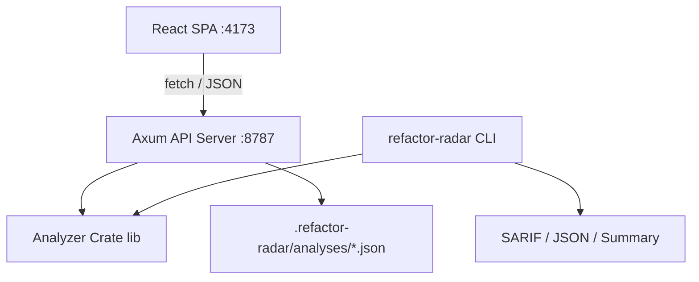

<p align="center">
  <a href="https://github.com/user/refactor-radar/actions"></a>
  
  
</p>

<p align="center">
  English | <a href="./README.zh-CN.md">简体中文</a>
</p>

<h1 align="center">Refactor Radar</h1>

<p align="center">
  <strong>A local-first static analysis tool that answers: "What should we refactor first?"</strong><br />
  Scan your JS/TS codebase, surface structural issues, and get a ranked, evidence-backed action plan.
</p>

---

## Why Refactor Radar?

Linters tell you which rules were violated. Refactor Radar answers the harder planning question: **what should we refactor first?**

It scans a local JS/TS repository, maps its dependency structure, detects 7 types of high-impact refactoring opportunities, and ranks every finding with concrete evidence — files, metrics, confidence, and suggested actions. No cloud, no API keys, and no source code leaves your machine.

## Features

- **7 Issue Types Detected** — Large Module, Dependency Hotspot, Circular Dependency, Duplication Candidate, Long Parameter List, Deep Nesting, and God Function
- **Priority Scoring** — Every issue gets a score so you always know what to fix first
- **Interactive Dashboard** — Issue distribution, severity breakdown, file metrics, and priority ranking charts
- **Dependency Graph** — Force-directed SVG graph with drag, zoom, pan, and cycle highlighting
- **CLI Mode** — Run analysis from the command line with `refactor-radar <path>`, no server needed
- **SARIF 2.1.0 Output** — Export results as SARIF for GitHub Code Scanning and CI/CD integration
- **Config Passthrough** — `.refactor-radar.toml` project config + API request overrides + Settings UI, all the way to the analyzer
- **Semantic Exit Codes** — CI-friendly exit codes for quality gate enforcement
- **Server Connection Detection** — Frontend automatically detects whether the API server is available
- **Configuration Support** — Customize thresholds and enabled rules via `.refactor-radar.toml`
- **Dark Mode** — System-aware theme with manual toggle, persisted preference
- **Bilingual UI** — Chinese / English toggle with persistent preference
- **Persistent History** — Reopen recent analyses without rescanning the repository
- **Portable Reports** — Export findings as JSON, CSV, or Markdown
- **Responsive Design** — Works on desktop and mobile screens
- **Graceful Server** — Structured logging (tracing), CLI args (clap), health endpoint, graceful shutdown

## Quick Start

### Prerequisites

- **Rust toolchain** (stable, via [rustup](https://rustup.rs/))
- **Node.js** 20+ and **npm** 10+

### Run

Open two terminals:

**Terminal 1 — Rust API server:**
```bash
cargo run -p server
```
Server starts on `http://127.0.0.1:8787`.

**Terminal 2 — Web dashboard:**
```bash
cd web
npm install
npm run dev
```
Dashboard opens on `http://127.0.0.1:4173`.

### Usage

#### Web Dashboard

1. Paste a local JS/TS project path into the input field
2. Click **Analyze Repository**
3. Explore the dashboard:
   - **Overview** — Issue type distribution + severity breakdown
   - **Files** — Top files by lines / functions / fan-in / fan-out
   - **Priority** — Ranked bar chart of highest-priority issues
   - **Dependency Graph** — Interactive force-directed graph with cycle highlighting
4. Click any issue in the list to see evidence and suggested refactor actions

#### CLI Mode (no server needed)

```bash
# Basic analysis
refactor-radar ./my-project

# Use a custom config file
refactor-radar ./my-project --config .refactor-radar.toml

# Output as SARIF for CI/CD integration
refactor-radar ./my-project --format sarif > results.sarif

# Output as JSON
refactor-radar ./my-project --format json > results.json

# Human-readable summary
refactor-radar ./my-project --format summary
```

Exit codes: `0` = no issues, `1` = issues found, `2` = error.

## Screenshots

<p align="center">
  
  <em>Complete workflow: local repository input, structural overview, ranked findings, evidence, and suggested actions.</em>
</p>

<p align="center">
  
  
  <em>Left: Top files by lines / functions / fan-in / fan-out. Right: Priority ranking of top 10 issues.</em>
</p>

## Architecture

Refactor Radar uses a three-tier architecture with both web and CLI interfaces:



| Layer | Technology |
|-------|-----------|
| Analysis engine | Rust — regex-based parsing, BTreeMap dependency graph, Tarjan SCC cycle detection, Jaccard duplication |
| CLI | Clap + SARIF 2.1.0 serializer |
| HTTP server | Axum 0.7 + Tokio async runtime + tower-http CORS + tracing + clap |
| Frontend | React 18 + TypeScript + Vite + React Router |
| Charts | Recharts (pie, bar, horizontal bar) |
| Graph | D3-force (force-directed layout) + native SVG rendering |

## Configuration

Refactor Radar supports three levels of configuration, all using the same TOML format:

### 1. Project-level config (recommended)

Create a `.refactor-radar.toml` file in your project root. This is automatically loaded by both the CLI and the API server:

```toml
# Thresholds
lineThreshold = 45          # Max lines before flagging as Large Module
functionThreshold = 5       # Max functions before flagging
fanInThreshold = 2          # Max fan-in before flagging as Dependency Hotspot
fanOutThreshold = 4         # Max fan-out before flagging as Dependency Hotspot
longParameterListThreshold = 4  # Max parameters per function
deepNestingThreshold = 4        # Max nesting depth
godFunctionThreshold = 10       # Max complexity score per function
duplicationSimilarityThreshold = 0.7  # Jaccard similarity threshold (0.0–1.0)

# Rules to enable (all enabled by default)
enabledRules = [
  "large_module",
  "dependency_hotspot",
  "circular_dependency",
  "duplication_candidate",
  "long_parameter_list",
  "deep_nesting",
  "god_function",
]

# Glob patterns to exclude
excludePatterns = [
  "dist/**",
  "node_modules/**",
  "*.test.ts",
]
```

### 2. API request overrides

Pass a `config` field in the `/api/analyze` request body to override project config at runtime:

```json
{
  "repoPath": "./my-project",
  "config": {
    "lineThreshold": 60,
    "enabledRules": ["large_module", "circular_dependency"]
  }
}
```

### 3. Settings UI

The web dashboard Settings page lets you adjust thresholds interactively. Values are sent to the API as request overrides.

## CI/CD Integration

### GitHub Actions with SARIF

```yaml
- name: Run Refactor Radar
  run: |
    cargo install --path .
    refactor-radar . --format sarif > results.sarif

- name: Upload SARIF
  uses: github/codeql-action/upload-sarif@v3
  with:
    sarif_file: results.sarif
```

### Quality gates with exit codes

```bash
# Fail CI if any issues are found
refactor-radar . --format summary
# exit code 0 = clean, 1 = issues found, 2 = error
```

## API Reference

| Endpoint | Method | Description |
|----------|--------|-------------|
| `/health` | GET | Health check — returns `{ "status": "ok", "version": "..." }` |
| `/api/analyze` | POST | Start analysis. Body: `{ "repoPath": "...", "config": { ... } }` |
| `/api/analyze/:id/status` | GET | Poll analysis progress (phase, done, error) |
| `/api/analyze/:id/results` | GET | Fetch full analysis result (files + issues) |
| `/api/analyze/:id/issues/:issue_id` | GET | Fetch a single issue with evidence |
| `/api/analyses` | GET | List recent persisted analyses |
| `/api/analyses/:id` | GET | Load a persisted analysis by ID |

Results are persisted to `.refactor-radar/analyses/` as JSON files.

## Development

### Build

```bash
# Build all Rust crates
cargo build

# Build frontend for production
cd web && npm run build
```

### Test

```bash
# Rust analyzer tests
cargo test -p analyzer

# All Rust tests
cargo test

# Web UI tests (Vitest)
cd web && npm test
```

### Run locally

```bash
# Start API server (Terminal 1)
cargo run -p server

# Start frontend dev server (Terminal 2)
cd web && npm run dev
```

### Docker

```bash
# Build and run with Docker Compose
docker compose up --build

# Or build the image manually
docker build -t refactor-radar .
docker run -p 8787:8787 refactor-radar
```

## Roadmap

- [x] CLI mode with SARIF output for CI/CD integration
- [x] Config passthrough from UI/API to analyzer
- [ ] Support additional languages (Python, Go, Java)
- [ ] AST-backed semantic duplication detection (tree-sitter)
- [ ] Editor integrations (VS Code extension)
- [ ] PR and diff analysis mode
- [ ] Opt-in AI explanation layer for complex findings
- [ ] Auto-fix suggestions for selected patterns

## Contributing

See [CONTRIBUTING.md](./CONTRIBUTING.md) for development flow, how to add new detection rules, and coding standards.

## License

[MIT](./LICENSE)
