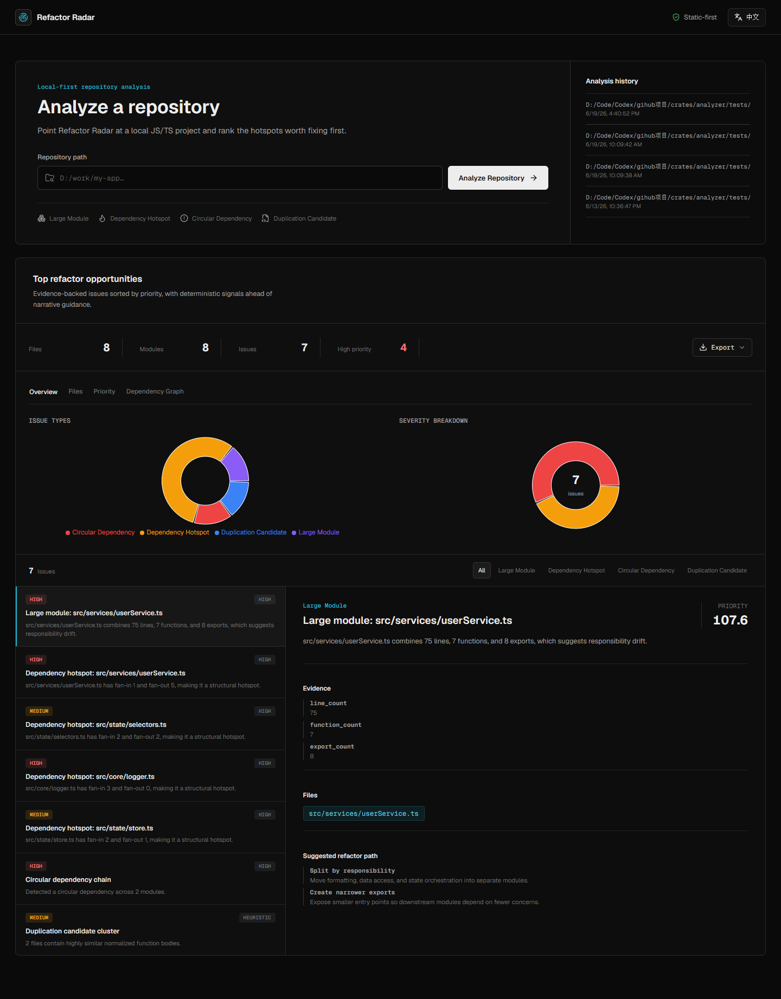
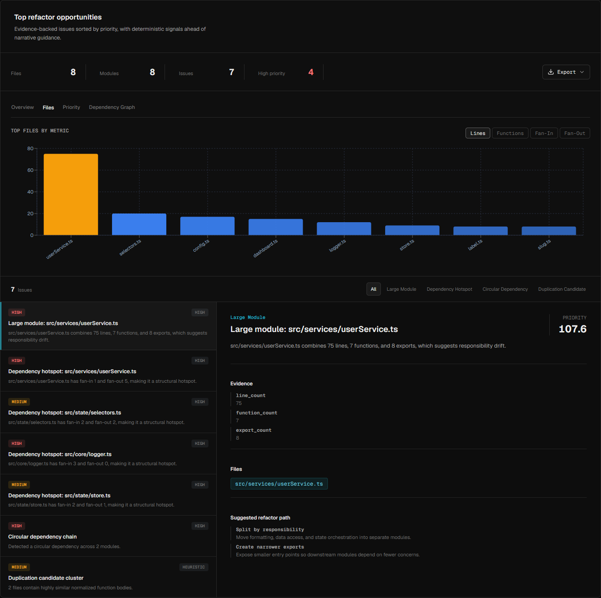
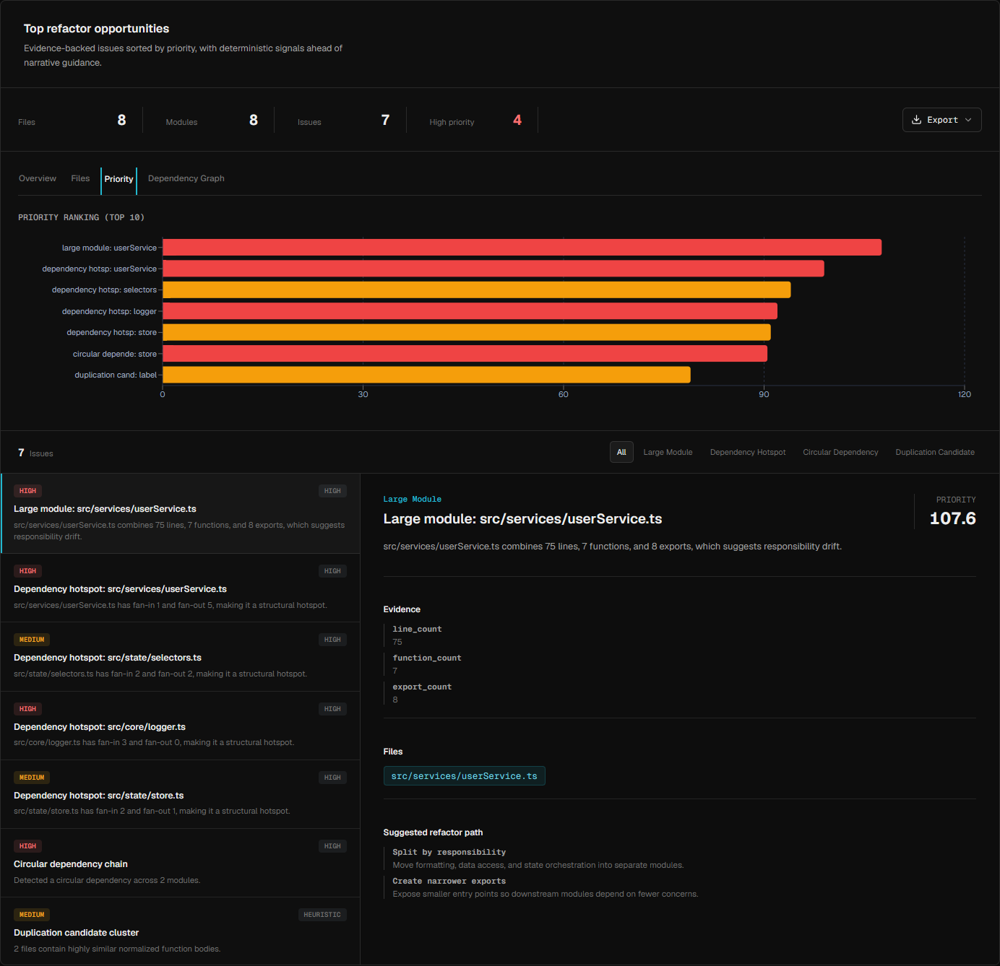

<p align="center">
  
  
  
  
</p>

<p align="center">
  English | <a href="./README.zh-CN.md">简体中文</a>
</p>

<h1 align="center">Refactor Radar</h1>

<p align="center">
  <strong>A local-first refactoring radar for JavaScript and TypeScript.</strong><br />
  Turn structural signals into an evidence-backed, ranked action plan.
</p>

---

## Why Refactor Radar?

Linters tell you which rules were violated. Refactor Radar answers the harder planning question: **what should we refactor first?**

It scans a local JS/TS repository, maps its dependency structure, detects high-impact refactoring opportunities, and ranks every finding with concrete evidence. No cloud, no API keys, and no source code leaves your machine.

- **Evidence over intuition:** every recommendation includes files, metrics, confidence, and suggested actions.
- **Priorities over noise:** findings are scored so teams can start with the highest-leverage change.
- **Private and repeatable:** analyses run locally and remain available in persistent history.

## Features

| Feature | Description |
|---------|-------------|
| **Large Module Detection** | Flags files with too many lines, functions, or exports |
| **Dependency Hotspots** | Identifies files with high fan-in or fan-out |
| **Circular Dependencies** | Detects cyclic strongly connected components with Tarjan's algorithm |
| **Duplication Candidates** | Heuristic detection of near-identical function bodies |
| **Priority Scoring** | Every issue gets a score so you always know what to fix first |
| **Interactive Charts** | Issue distribution, severity breakdown, file metrics, priority ranking |
| **Dependency Graph** | Force-directed SVG graph with drag, zoom, pan, and cycle highlighting |
| **Persistent History** | Reopen recent analyses without rescanning the repository |
| **Portable Reports** | Export findings as JSON, CSV, or Markdown |
| **i18n** | Chinese / English toggle with persistent preference |

## Screenshots

<p align="center">
  
  <em>Complete workflow: local repository input, structural overview, ranked findings, evidence, and suggested actions.</em>
</p>

<p align="center">
  
  
  <em>Left: Top files by lines / functions / fan-in / fan-out. Right: Priority ranking of top 10 issues.</em>
</p>

## Architecture

```
refactor-radar/
├── crates/
│   ├── analyzer/     # Core analysis engine (Rust)
│   │   ├── src/
│   │   │   └── lib.rs        # File discovery, parsing, graph, rules, scoring
│   │   └── tests/
│   │       ├── analysis_fixture.rs
│   │       └── fixtures/sample_repo/
│   └── server/       # Axum HTTP API (Rust)
│       └── src/
│           └── main.rs       # Job orchestration, result persistence
├── web/              # React + Vite dashboard (TypeScript)
│   ├── src/
│   │   ├── App.tsx
│   │   ├── lib/
│   │   │   ├── api.ts        # HTTP client for Rust API
│   │   │   ├── types.ts      # Shared type definitions
│   │   │   └── i18n.ts       # Translation dictionary + context
│   │   └── components/
│   │       ├── charts/       # Recharts-based visualizations
│   │       ├── graph/        # D3-force dependency graph
│   │       └── layout/       # VisualizationTabs
│   └── package.json
├── Cargo.toml        # Workspace root
└── README.md
```

## Quick Start

### Prerequisites

- **Rust toolchain** (stable, via [rustup](https://rustup.rs/))
- **Node.js** 20+ and **npm** 10+

### Run

Open two terminals:

**Terminal 1 — Rust API server:**
```bash
cargo run -p server
```
Server starts on `http://127.0.0.1:8787`.

**Terminal 2 — Web dashboard:**
```bash
cd web
npm install
npm run dev
```
Dashboard opens on `http://127.0.0.1:4173`.

### Usage

1. Paste a local JS/TS project path into the input field
2. Click **Analyze Repository**
3. Explore the dashboard:
   - **Overview** — Issue type distribution + severity breakdown
   - **Files** — Top files by lines / functions / fan-in / fan-out
   - **Priority** — Ranked bar chart of highest-priority issues
   - **Dependency Graph** — Interactive force-directed graph with cycle highlighting
4. Click any issue in the list to see evidence and suggested refactor actions

## API Reference

| Endpoint | Method | Description |
|----------|--------|-------------|
| `/api/analyze` | POST | Start analysis. Body: `{ "repoPath": "..." }` |
| `/api/analyze/:id/status` | GET | Poll analysis progress (phase, done, error) |
| `/api/analyze/:id/results` | GET | Fetch full analysis result (files + issues) |
| `/api/analyze/:id/issues/:issue_id` | GET | Fetch a single issue with evidence |
| `/api/analyses` | GET | List recent persisted analyses |
| `/api/analyses/:id` | GET | Load a persisted analysis by ID |

Results are persisted to `.refactor-radar/analyses/` as JSON files.

## Tech Stack

| Layer | Technology |
|-------|-----------|
| Analysis engine | Rust - regex-based parsing, BTreeMap dependency graph, Tarjan SCC cycle detection |
| HTTP server | Axum 0.7 + Tokio async runtime + tower-http CORS |
| Frontend | React 18 + TypeScript + Vite |
| Charts | Recharts (pie, bar, horizontal bar) |
| Graph | D3-force (force-directed layout) + native SVG rendering |
| Fonts | Geist Sans + Geist Mono (self-hosted through Fontsource) |

## Testing

```bash
# Rust analyzer tests
cargo test -p analyzer

# Web UI tests (Vitest)
cd web && npm run test

# Type check + production build
cd web && npm run build
```

## Roadmap

- [ ] Support additional languages (Python, Go, Java)
- [ ] AST-backed semantic duplication detection (tree-sitter)
- [ ] Editor integrations (VS Code extension)
- [ ] PR and diff analysis mode
- [ ] Opt-in AI explanation layer for complex findings
- [ ] Auto-fix suggestions for selected patterns

## Contributing

See [CONTRIBUTING.md](./CONTRIBUTING.md) for development flow and standards.

## License

[MIT](./LICENSE)
