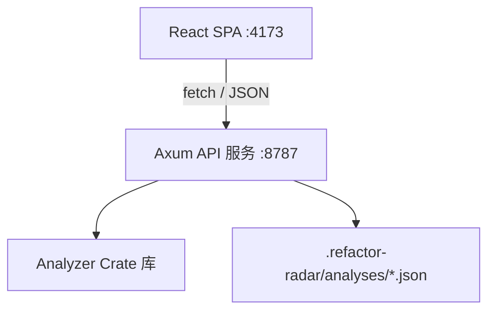

<p align="center">
  <a href="https://github.com/user/refactor-radar/actions"></a>
  
  
</p>

<p align="center">
  <a href="./README.md">English</a> | <strong>简体中文</strong>
</p>

<h1 align="center">Refactor Radar</h1>

<p align="center">
  <strong>本地优先的静态分析工具，回答："我们应该先重构什么？"</strong><br />
  扫描你的 JS/TS 代码库，发现结构问题，获得有证据支撑、按优先级排序的行动计划。
</p>

---

## 为什么选择 Refactor Radar？

Lint 工具会告诉你违反了哪些规则。Refactor Radar 回答更难的规划问题：**应该先重构什么？**

它扫描本地 JS/TS 代码库，绘制依赖结构，识别 7 种高影响力的重构机会，并用具体证据为每项发现排序——文件、指标、置信度和建议操作。无需云服务，无需 API 密钥，源代码不会离开你的机器。

## 功能特性

- **检测 7 种问题类型** — 大模块、依赖热点、循环依赖、重复候选、长参数列表、深层嵌套、上帝函数
- **优先级评分** — 每个问题都有评分，让你始终知道该先修什么
- **交互式仪表板** — 问题分布、严重度分布、文件指标和优先级排行图表
- **依赖关系图** — 力导向 SVG 图形，支持拖拽、缩放、平移和循环高亮
- **配置支持** — 通过 `.refactor-radar.toml` 自定义阈值和启用的规则
- **深色模式** — 系统感知主题，支持手动切换，偏好设置持久化保存
- **双语界面** — 中文 / 英文切换，偏好设置持久化保存
- **持久化历史** — 无需重新扫描即可打开最近的分析结果
- **可移植报告** — 将分析结果导出为 JSON、CSV 或 Markdown
- **响应式设计** — 适配桌面和移动设备屏幕
- **优雅服务** — 结构化日志（tracing）、CLI 参数（clap）、健康检查端点、优雅关闭

## 快速开始

### 前置条件

- **Rust 工具链**（稳定版，通过 [rustup](https://rustup.rs/) 安装）
- **Node.js** 20+ 和 **npm** 10+

### 运行

打开两个终端：

**终端 1 — Rust API 服务：**
```bash
cargo run -p server
```
服务启动后监听 `http://127.0.0.1:8787`。

**终端 2 — Web 仪表板：**
```bash
cd web
npm install
npm run dev
```
仪表板在 `http://127.0.0.1:4173` 打开。

### 使用方法

1. 在输入框中粘贴本地 JS/TS 项目路径
2. 点击 **开始分析**
3. 浏览仪表板：
   - **概览** — 问题类型分布 + 严重度分布
   - **文件** — 按行数 / 函数数 / fan-in / fan-out 排列的文件排行
   - **优先级** — 最高优先级问题的水平柱状图
   - **依赖图** — 交互式力导向图，循环依赖红色高亮
4. 点击列表中的任意问题，查看证据和建议的重构方向

## 效果截图

<p align="center">
  
  <em>完整工作流：本地代码库输入、结构概览、排序后的发现、证据与建议操作。</em>
</p>

<p align="center">
  
  
  <em>左：按行数 / 函数数 / fan-in / fan-out 排列的文件排行。右：前 10 个最高优先级问题排行。</em>
</p>

## 项目架构

Refactor Radar 采用三层架构：



| 层级 | 技术 |
|------|------|
| 分析引擎 | Rust - 基于正则的解析、BTreeMap 依赖图、Tarjan SCC 循环检测、Jaccard 重复检测 |
| HTTP 服务 | Axum 0.7 + Tokio 异步运行时 + tower-http CORS + tracing + clap |
| 前端 | React 18 + TypeScript + Vite + React Router |
| 图表 | Recharts（饼图、柱状图、水平柱状图） |
| 图形 | D3-force（力导向布局）+ 原生 SVG 渲染 |

## 配置

在项目根目录创建 `.refactor-radar.toml` 文件来自定义分析行为：

```toml
# 阈值配置
lineThreshold = 45          # 超过此行数标记为大模块
functionThreshold = 5       # 超过此函数数标记
fanInThreshold = 2          # 超过此 fan-in 标记为依赖热点
fanOutThreshold = 4         # 超过此 fan-out 标记为依赖热点
longParameterListThreshold = 4  # 每个函数的最大参数数
deepNestingThreshold = 4        # 最大嵌套深度
godFunctionThreshold = 10       # 每个函数的最大复杂度分数
duplicationSimilarityThreshold = 0.7  # Jaccard 相似度阈值（0.0–1.0）

# 启用的规则（默认全部启用）
enabledRules = [
  "large_module",
  "dependency_hotspot",
  "circular_dependency",
  "duplication_candidate",
  "long_parameter_list",
  "deep_nesting",
  "god_function",
]

# 排除的 glob 模式
excludePatterns = [
  "dist/**",
  "node_modules/**",
  "*.test.ts",
]
```

## API 参考

| 端点 | 方法 | 描述 |
|------|------|------|
| `/health` | GET | 健康检查 — 返回 `{ "status": "ok", "version": "..." }` |
| `/api/analyze` | POST | 启动分析。请求体：`{ "repoPath": "..." }` |
| `/api/analyze/:id/status` | GET | 轮询分析进度（阶段、完成状态、错误） |
| `/api/analyze/:id/results` | GET | 获取完整分析结果（文件 + 问题列表） |
| `/api/analyze/:id/issues/:issue_id` | GET | 获取单个问题的详细信息和证据 |
| `/api/analyses` | GET | 列出最近持久化保存的分析 |
| `/api/analyses/:id` | GET | 按 ID 加载已保存的分析 |

分析结果以 JSON 格式持久化存储于 `.refactor-radar/analyses/` 目录。

## 开发

### 构建

```bash
# 构建所有 Rust crate
cargo build

# 构建前端生产版本
cd web && npm run build
```

### 测试

```bash
# Rust 分析器测试
cargo test -p analyzer

# 所有 Rust 测试
cargo test

# Web UI 测试 (Vitest)
cd web && npm test
```

### 本地运行

```bash
# 启动 API 服务（终端 1）
cargo run -p server

# 启动前端开发服务器（终端 2）
cd web && npm run dev
```

### Docker

```bash
# 使用 Docker Compose 构建并运行
docker compose up --build

# 或手动构建镜像
docker build -t refactor-radar .
docker run -p 8787:8787 refactor-radar
```

## 路线图

- [ ] 支持更多编程语言（Python、Go、Java）
- [ ] 基于 AST 的语义级重复检测（tree-sitter）
- [ ] CI 集成 — 将分析结果作为 PR 评论发布
- [ ] 编辑器集成（VS Code 扩展）
- [ ] PR 和 diff 分析模式
- [ ] 可选的 AI 解释层，用于复杂发现
- [ ] 针对特定模式的自动修复建议

## 贡献

请参阅 [CONTRIBUTING.md](./CONTRIBUTING.md) 了解开发流程、如何添加新的检测规则以及编码规范。

## 许可证

[MIT](./LICENSE)
